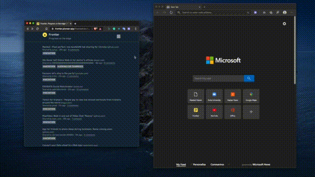

# Manted

## Demo Video (click image)

https://www.youtube.com/watch?v=1gsWWY56H6o

Screen sharing quality can suck, especially for people on weaker connections. This is because most screen sharing implementations are encoding the screen as video frames, compressing them, sending them over the wire, and then decompressing them. This takes up a lot of additional latency (which must be traded off with quality), and lossy compression frequently makes things unreadable (this is particularly an issue with Tandem recently):

What if instead of streaming video frames from the screen, we only streamed partial DOM updates from websites? That way, we can reproduce pixel-perfect versions of your active Chrome tab with extremely low latency and bandwidth consumption.

Welcome to Manted.

## Installing

See the [releases page](https://github.com/calderajs/manted/releases)

## Server repository

https://github.com/calderajs/manted-server

This contains the viewer frontend and the server.

## Libraries used

- We use a fork of rrweb (https://github.com/yunyu/rrweb) that adds support for fast-forward-from-checkpoint and replay events after playback is finished (to support the live sharing functionality).
- Chrome extension boilerplate with React: https://github.com/samuelsimoes/chrome-extension-webpack-boilerplate

# Building

- `yarn run start` to start, load unpacked chrome extension from manted/build
- `yarn run build` to build.

Unfortunately, I don't think we will be able to get this accepted by the Chrome Web Store in time, but we will be providing a zip file of the final version so you can try it out. The server has no validation whatsoever, so there's a good chance it'll crash under any load.
